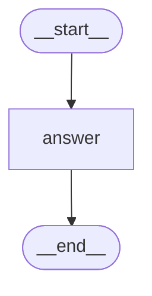

# LangGraph Basics — Part 1: StateGraph, Nodes & Edges

[](https://shafiqulai.github.io)
[](#)
[](https://python.org)
[](https://github.com/langchain-ai/langgraph)
[](../../LICENSE)

> **Read the full tutorial →** [shafiqulai.github.io/blogs/blog_8.html](https://shafiqulai.github.io/blogs/blog_8.html)

---

## What This Project Covers

Every LangGraph application — no matter how complex — is built from three primitives. This project introduces all three from scratch:

| Primitive | What It Is |
|-----------|-----------|
| **State** | A shared `TypedDict` that flows through the graph. Every node reads from it and writes back to it. |
| **Nodes** | Python functions (or methods) that do the actual work. Each node receives the current state and returns a partial update. |
| **Edges** | Connections between nodes that tell LangGraph which node runs next. |

The project puts these three together to build a simple **Q&A bot**: one node, one edge, powered by Google Gemini. No branching, no memory — just the clearest possible demonstration of how a LangGraph graph is wired and runs.

---

## Key Concepts

| Concept | What It Is |
|---------|-----------|
| `StateGraph` | The graph container — takes a state class and holds all nodes and edges |
| `TypedDict` | Standard Python typed dict used to define the graph's shared state |
| `add_node(name, fn)` | Registers a function as a node under a string name |
| `add_edge(a, b)` | Declares that node `a` always runs before node `b` |
| `START` / `END` | LangGraph sentinels — the required entry and exit points of every graph |
| `graph.compile()` | Validates the graph structure and returns a `CompiledStateGraph` (a LangChain `Runnable`) |
| `app.invoke(state)` | Runs the graph synchronously, returning the final state dict |

---

## Graph Architecture

```
START
  │
  ▼
answer_node   ← receives state["question"], calls Gemini, returns {"answer": "..."}
  │
  ▼
 END
```

The simplest valid LangGraph graph: one node between `START` and `END`. The state enters with `question` set and exits with `answer` populated.

---

## Mermaid Diagram



---

## Project Structure

```
basics-1-stategraph-nodes-edges/
├── state.py        # QAState — question (str) and answer (str)
├── nodes.py        # QANodes — answer_node calls Gemini and returns {"answer": "..."}
├── graph.py        # QAGraph — builds StateGraph, wires START → answer → END, compiles
├── qa_runner.py    # QARunner — console entry point, runs three demo questions
├── app.py          # QAApp — Gradio ChatInterface wrapping the same runner
├── config.py       # Config — loads .env, exposes MODEL_NAME, TEMPERATURE, MAX_RETRIES
├── llm.py          # GeminiLLM — wraps ChatGoogleGenerativeAI using Config
└── figure/         # Auto-generated graph diagrams (graph.mmd, graph.png)
```

---

## State

```python
from typing import TypedDict

class QAState(TypedDict):
    question: str  # set before invoke() — the user's input
    answer:   str  # populated by answer_node — the LLM's response
```

Two fields, two owners. `question` is set once at the start and never changed. `answer_node` is the only node, so it writes `answer` without any risk of conflict. Both fields use LangGraph's default last-write-wins merge — no reducers needed at this stage.

---

## The Node

```python
class QANodes:
    def __init__(self):
        self.llm = GeminiLLM().get_llm()   # created once, reused on every call

    def answer_node(self, state: QAState) -> dict:
        response = self.llm.invoke(state["question"])
        content = response.content

        # langchain-google-genai 4.x returns a list of content blocks, not a plain string
        if isinstance(content, list):
            content = " ".join(
                block.get("text", "")
                for block in content
                if isinstance(block, dict) and block.get("type") == "text"
            )

        return {"answer": content}   # partial state update — only the key that changed
```

Three things to notice:
1. **Returns a partial dict** — not a full `QAState`. LangGraph merges it back into state automatically.
2. **LLM created once in `__init__`** — not on every call, avoiding repeated client construction overhead.
3. **Handles both API response formats** — `langchain-google-genai` 4.x returns `response.content` as a list of typed blocks; older versions return a plain string. The check handles both.

---

## Wiring the Graph

```python
from langgraph.graph import END, START, StateGraph
from nodes import QANodes
from state import QAState

class QAGraph:
    def __init__(self):
        self.nodes = QANodes()
        self.compiled_graph = self._build()   # built once, stored, reused

    def _build(self):
        graph = StateGraph(QAState)           # 1. create the container

        graph.add_node("answer", self.nodes.answer_node)  # 2. register node

        graph.add_edge(START, "answer")       # 3. entry point
        graph.add_edge("answer", END)         # 4. exit point

        return graph.compile()                # 5. validate + return Runnable
```

`compile()` does two things: it validates the graph (checks that every node is reachable, that there's a path from `START` to `END`) and returns a `CompiledStateGraph` that implements LangChain's `Runnable` interface — meaning you can call `.invoke()`, `.stream()`, or `.ainvoke()` on it.

---

## Running the Graph

```python
class QARunner:
    def __init__(self):
        self.app = QAGraph().get_compiled_graph()

    def run(self, question: str) -> str:
        result = self.app.invoke({"question": question})
        return result["answer"]
```

`invoke()` takes the initial state — a plain dict — runs the graph from `START` to `END`, and returns the final state dict. We pass `question` in; we get `answer` back out.

---

## Example Output

```
============================================================
         LangGraph Basics — Q&A Bot Demo
============================================================

 Saving graph architecture...
  Graph saved → figure/graph.mmd
  Graph saved → figure/graph.png

[1] What is LangGraph in one sentence?
------------------------------------------------------------
LangGraph is a Python framework for building stateful,
graph-based AI workflows where processing steps are nodes
connected by edges that share data through a central state.
============================================================

[2] What is the difference between a node and an edge in LangGraph?
------------------------------------------------------------
A node is a function that processes the state and returns
an update; an edge is a connection that tells LangGraph
which node to run next.
============================================================

[3] Why do we need state in LangGraph?
------------------------------------------------------------
State is the shared memory that flows through the graph —
it lets nodes pass data to each other without direct
coupling, so any node can read what a previous node wrote.
============================================================
```

---

## How to Run

**Prerequisites:** complete the setup in the [root README](../../README.md) (virtual environment + `.env` file).

**Console runner:**

```bash
cd basics-1-stategraph-nodes-edges
python qa_runner.py
```

**Gradio web UI:**

```bash
cd basics-1-stategraph-nodes-edges
python app.py
```

The web UI starts at `http://127.0.0.1:7860`. Type any question and Gemini answers through the LangGraph pipeline.

**Questions to try:**

| Question | What it demonstrates |
|----------|---------------------|
| `"What is LangGraph?"` | Basic Q&A flow through the graph |
| `"Explain state in LangGraph"` | Graph returning a detailed answer |
| `"What does compile() do in LangGraph?"` | Meta-question about the framework itself |

---

## Full Tutorial

Everything above — the concepts, the code walkthrough, how `StateGraph` works under the hood, and a live Gradio demo — is covered in detail in the blog post:

**[LangGraph Basics: Part 1 — StateGraph, Nodes & Edges](https://shafiqulai.github.io/blogs/blog_8.html)**

---

## Series Navigation

| Part | Topic | Link |
|------|-------|------|
| **Part 1** | **StateGraph, Nodes & Edges** | **You are here** |
| Part 2 → | State, Annotated Fields & Custom Reducers | [basics-2-state-annotated-reducers/](../basics-2-state-annotated-reducers/) |
| Part 3 → | Conditional Edges & Routing Logic | [basics-3-conditional-edges/](../basics-3-conditional-edges/) |

---

## Author

**Md Shafiqul Islam** — AI Engineer / LLM Specialist  
Blog: [shafiqulai.github.io](https://shafiqulai.github.io)
