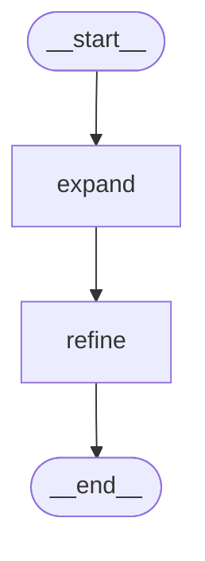

# LangGraph Basics — Part 2: State, Annotated Fields & Custom Reducers

[](https://shafiqulai.github.io)
[](#)
[](https://python.org)
[](https://github.com/langchain-ai/langgraph)
[](../../LICENSE)

> **Read the full tutorial →** [shafiqulai.github.io/blogs/blog_9.html](https://shafiqulai.github.io/blogs/blog_9.html)

---

## What This Project Covers

In Part 1, state fields were always replaced when a node returned a new value. That works fine when each field is owned by exactly one node — but breaks silently when two nodes need to *add to the same field*.

**Part 2 introduces reducers** — the mechanism that tells LangGraph how to merge a new value into an existing field instead of overwriting it.

The key tool is Python's `Annotated` type hint. By annotating a field with a reducer function, you change LangGraph's merge behaviour for that field only. Every other field still uses last-write-wins.

This project builds a **Topic Expander**: a two-node graph where both nodes write to the same `points` list. `expand_node` generates 3 key points about a topic; `refine_node` reads those points and adds 3 deeper insights. Because `points` is annotated with `operator.add`, all 6 items accumulate in state — none are lost.

---

## Key Concepts

| Concept | What It Is |
|---------|-----------|
| `TypedDict` | The standard way to define a LangGraph state — plain Python typed dict |
| Last-write-wins | LangGraph's default: when a node updates a field, the new value replaces the old |
| `Annotated[T, reducer]` | Overrides the default for one field — new values are *merged* using the reducer |
| `operator.add` | Built-in reducer for lists: `operator.add([1,2], [3,4])` → `[1,2,3,4]` |
| `add_messages` | LangChain's built-in reducer for `BaseMessage` lists (deduplication + append) |
| `MessagesState` | Pre-built state class with a `messages` field already annotated with `add_messages` |

---

## The Problem Reducers Solve

```python
# Without a reducer — second write silently drops the first
state["points"] = ["Point A", "Point B"]   # expand_node writes this
state["points"] = ["Point C"]              # refine_node overwrites — Points A and B are gone
# Result: ["Point C"]  ← data loss

# With operator.add — both writes are merged
# expand_node returns {"points": ["Point A", "Point B"]}
# refine_node returns {"points": ["Point C"]}
# LangGraph calls operator.add(["Point A", "Point B"], ["Point C"])
# Result: ["Point A", "Point B", "Point C"]  ← nothing lost
```

---

## Graph Architecture

```
START
  │
  ▼
expand_node   ← asks Gemini for 3 key points → writes [Expand] items to state["points"]
  │
  ▼
refine_node   ← reads accumulated points → appends [Refine] insights via operator.add
  │             also writes state["summary"]
  ▼
 END
```

Both nodes write to `state["points"]`. Because the field is annotated with `operator.add`, LangGraph concatenates the lists — 3 items from `expand_node` + 3 from `refine_node` = 6 items in the final state.

---

## Mermaid Diagram



---

## Project Structure

```
basics-2-state-annotated-reducers/
├── state.py            # TopicState — topic (str), points (Annotated), summary (str)
├── nodes.py            # TopicNodes — expand_node and refine_node
├── graph.py            # TopicGraph — wires START → expand → refine → END
├── topic_runner.py     # TopicRunner — console entry point, runs demo topics
├── app.py              # TopicApp — Gradio web UI (Topic Expander)
├── config.py           # Config — loads .env, exposes model settings
├── llm.py              # GeminiLLM — wraps ChatGoogleGenerativeAI
├── prompts/
│   ├── expand_node.txt # Prompt for expand_node — uses {topic} placeholder
│   └── refine_node.txt # Prompt for refine_node — uses {topic} and {existing} placeholders
└── figure/             # Auto-generated graph diagrams (graph.mmd, graph.png)
```

---

## State

```python
import operator
from typing import Annotated, TypedDict

class TopicState(TypedDict):
    topic:   str                              # input — the subject to explore
    points:  Annotated[list[str], operator.add]  # accumulates across nodes
    summary: str                              # written once by refine_node
```

Three things to notice:
1. **`topic` and `summary` use last-write-wins** — only one node writes each, so the default is fine.
2. **`points` uses `operator.add`** — both `expand_node` and `refine_node` return a `{"points": [...]}` update; LangGraph concatenates the lists automatically.
3. **The reducer is just a function** — `operator.add` works here because both values are lists. For integers you could use `operator.add` too (it handles `int + int`). For anything else, write your own function.

---

## The Nodes

```python
def expand_node(self, state: TopicState) -> dict:
    prompt = self.expand_prompt.format(topic=state["topic"])
    response = self.llm.invoke(prompt)
    lines = [f"[Expand] {ln.strip()}" for ln in content.strip().splitlines() if ln.strip()]
    return {"points": lines[:3]}   # operator.add appends this to existing points

def refine_node(self, state: TopicState) -> dict:
    existing = "\n".join(f"- {p}" for p in state["points"])  # reads expanded points
    prompt = self.refine_prompt.format(topic=state["topic"], existing=existing)
    response = self.llm.invoke(prompt)
    insights = [f"[Refine] {ln.strip()}" for ln in content.strip().splitlines() if ln.strip()]
    return {
        "points": insights[:len(state["points"])],  # operator.add appends these too
        "summary": f"Explored '{state['topic']}' across {len(state['points'])} key aspects.",
    }
```

`refine_node` can *read* the points written by `expand_node` from state, then *return new points* that get appended. The `[Expand]` and `[Refine]` prefixes make it easy to see in the output which node contributed each item.

---

## Example Output

```
📌 Topic: Machine Learning
────────────────────────────────────────────────────────────

Points collected:
  1. [Expand] Machine learning enables systems to learn from data without being explicitly programmed.
  2. [Expand] Supervised, unsupervised, and reinforcement learning are the three core paradigms.
  3. [Expand] Neural networks form the foundation of modern deep learning techniques.
  4. [Refine] The ability to generalise from training data to unseen examples is the central challenge.
  5. [Refine] Each paradigm requires different data structures and optimisation strategies.
  6. [Refine] Depth and architecture choices in neural networks dramatically affect capability and cost.

📝 Summary: Explored 'Machine Learning' across 3 key aspects with deeper insights.
```

---

## Default vs Annotated — Quick Comparison

| | Default (last-write-wins) | `Annotated[T, reducer]` |
|---|---|---|
| Two nodes update same field | Second write silently overwrites first | Both values merged using reducer |
| Use when | One node owns the field | Multiple nodes contribute to same field |
| Common reducers | — | `operator.add` (lists), `add_messages` (chat), custom function |
| Syntax | `field: list[str]` | `field: Annotated[list[str], operator.add]` |

---

## How to Run

**Prerequisites:** complete the setup in the [root README](../../README.md) (virtual environment + `.env` file).

**Console runner:**

```bash
cd basics-2-state-annotated-reducers
python topic_runner.py
```

The runner processes two demo topics ("Machine Learning" and "Climate Change") and prints the accumulated points with `[Expand]` / `[Refine]` labels so you can see exactly what each node contributed.

**Gradio web UI:**

```bash
cd basics-2-state-annotated-reducers
python app.py
```

The web UI starts at `http://127.0.0.1:7860`. Type any topic and the graph expands and refines it in one pass.

**Example topics to try:**

| Topic | What to observe |
|-------|----------------|
| `"Quantum Computing"` | 3 expand points + 3 refine insights = 6 total in state |
| `"Renewable Energy"` | Each `[Expand]` point gets a matching `[Refine]` insight |
| `"Large Language Models"` | `refine_node` reads `expand_node`'s output before generating |

---

## Full Tutorial

Everything above — the problem reducers solve, the `Annotated` syntax, `operator.add` vs `add_messages`, `MessagesState`, and a live Gradio demo — is covered in detail in the blog post:

**[LangGraph Basics: Part 2 — State, Annotated Fields & Custom Reducers](https://shafiqulai.github.io/blogs/blog_9.html)**

---

## Series Navigation

| Part | Topic | Link |
|------|-------|------|
| ← Part 1 | StateGraph, Nodes & Edges | [basics-1-stategraph-nodes-edges/](../basics-1-stategraph-nodes-edges/) |
| **Part 2** | **State, Annotated Fields & Custom Reducers** | **You are here** |
| Part 3 → | Conditional Edges & Routing Logic | [basics-3-conditional-edges/](../basics-3-conditional-edges/) |

---

## Author

**Md Shafiqul Islam** — AI Engineer / LLM Specialist  
Blog: [shafiqulai.github.io](https://shafiqulai.github.io)
