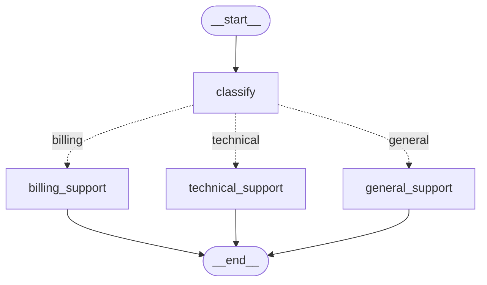

# LangGraph Basics — Part 3: Conditional Edges & Routing Logic

[](https://shafiqulai.github.io)
[](#)
[](https://python.org)
[](https://github.com/langchain-ai/langgraph)
[](../../LICENSE)

> **Read the full tutorial →** [shafiqulai.github.io/blogs/blog_10.html](https://shafiqulai.github.io/blogs/blog_10.html)

---

## What This Project Covers

In Parts 1 and 2, every node in the graph ran in a fixed sequence — A → B → C, always the same path. **Part 3 breaks that constraint.**

Conditional edges let the graph *decide at runtime* which node to run next, based on the current state. The decision is made by a plain Python function called a **router**. No new syntax — just a function that reads state and returns a node name as a string.

This project builds a **Customer Support Router**: a graph that reads an incoming support message, classifies it as `billing`, `technical`, or `general`, then routes to a dedicated support node that writes a tailored response.

---

## Key Concepts

| Concept | What It Is |
|---------|-----------|
| `add_conditional_edges()` | Registers a router function on a source node — the router's return value picks the next node |
| Router function | A plain Python function: takes `state`, returns a `str` (node name) |
| `Literal` type hint | Documents every valid return value of a router at the type level |
| Path map | A `dict` passed to `add_conditional_edges` that maps router return values to registered node names |
| Fallback | `dict.get(key, default)` in the router guards against unexpected LLM output |

---

## Graph Architecture

```
START
  │
  ▼
classify          ← reads the customer message, writes category to state
  │
  │  (conditional edge — route_by_category reads state["category"])
  ├─ ─ ─ ─ ─ ─▶  billing_support    ← empathetic billing response
  ├─ ─ ─ ─ ─ ─▶  technical_support  ← step-by-step troubleshooting
  └─ ─ ─ ─ ─ ─▶  general_support    ← friendly general inquiry response
                        │
                        ▼
                       END
```

> Solid arrows = normal edges (always run).  
> Dashed arrows = conditional edges (exactly one branch runs per invocation).

---

## Mermaid Diagram



---

## Project Structure

```
basics-3-conditional-edges/
├── state.py           # SupportState — shared TypedDict with message, category, response
├── router.py          # route_by_category() — reads category, returns node name
├── nodes.py           # SupportNodes — classify_node, billing_node, technical_node, general_node
├── graph.py           # SupportGraph — wires conditional edges, compiles graph
├── support_runner.py  # SupportRunner — console entry point
├── app.py             # SupportApp — Gradio web UI (Customer Support Router)
├── config.py          # Config — loads .env, exposes model settings
├── llm.py             # GeminiLLM — wraps ChatGoogleGenerativeAI
├── prompts/
│   ├── classify.txt   # Classifies message as billing / technical / general
│   ├── billing.txt    # Empathetic billing support prompt
│   ├── technical.txt  # Step-by-step troubleshooting prompt
│   └── general.txt    # Friendly general inquiry prompt
└── figure/            # Auto-generated graph diagrams (graph.mmd, graph.png)
```

---

## State

```python
class SupportState(TypedDict):
    message:  str   # customer's support message (input)
    category: str   # set by classify_node — drives the conditional edge
    response: str   # written by whichever support node runs
```

The `category` field is what the conditional edge reads. `classify_node` writes it; `route_by_category` reads it.

---

## The Router Function

```python
from typing import Literal
from state import SupportState

def route_by_category(
    state: SupportState,
) -> Literal["billing_support", "technical_support", "general_support"]:
    mapping = {
        "billing":   "billing_support",
        "technical": "technical_support",
        "general":   "general_support",
    }
    return mapping.get(state["category"], "general_support")  # safe fallback
```

Three things to notice:
1. **It's just a function** — no LangGraph-specific imports needed in `router.py`.
2. **`Literal` documents every valid return value** — a reader knows immediately what nodes exist.
3. **`dict.get(key, default)` adds a fallback** — if the LLM ever returns an unexpected category, the graph doesn't crash; it falls through to `general_support`.

---

## Wiring the Conditional Edge

```python
graph.add_edge(START, "classify")

graph.add_conditional_edges(
    "classify",           # source node
    route_by_category,    # router function
    {                     # path map: router return value → node name
        "billing_support":   "billing_support",
        "technical_support": "technical_support",
        "general_support":   "general_support",
    },
)

graph.add_edge("billing_support",   END)
graph.add_edge("technical_support", END)
graph.add_edge("general_support",   END)
```

`add_conditional_edges` takes three arguments: the source node, the router function, and a path map. After `classify` finishes, LangGraph calls `route_by_category(state)`, looks up the returned string in the path map, and runs that node next.

---

## Normal vs Conditional — Quick Comparison

| | `add_edge` | `add_conditional_edges` |
|---|---|---|
| Path decided | At build time | At runtime (per invocation) |
| Branches | 1 (fixed) | N (router picks one) |
| Router function | Not used | Required |
| Path map | Not used | Required |
| Use when | Sequence is always the same | Next step depends on state |

---

## How to Run

**Prerequisites:** complete the setup in the [root README](../../README.md) (virtual environment + `.env` file).

**Console runner:**

```bash
cd basics-3-conditional-edges
python support_runner.py
```

**Gradio web UI:**

```bash
cd basics-3-conditional-edges
python app.py
```

The web UI starts at `http://127.0.0.1:7860`. Type a support message and the router will classify it and respond in the appropriate tone.

**Example inputs to try:**

| Message | Expected Category | Routed To |
|---------|------------------|-----------|
| `"I was charged twice this month"` | `billing` | `billing_support` |
| `"My app keeps crashing on startup"` | `technical` | `technical_support` |
| `"What are your business hours?"` | `general` | `general_support` |

---

## Full Tutorial

Everything above — the concepts, the code walkthrough, the Mermaid diagram, and a live Gradio demo — is covered in detail in the blog post:

**[LangGraph Basics: Part 3 — Conditional Edges & Routing Logic](https://shafiqulai.github.io/blogs/blog_10.html)**

---

## Series Navigation

| Part | Topic | Link |
|------|-------|------|
| ← Part 2 | State, Annotated Fields & Custom Reducers | [basics-2-state-annotated-reducers/](../basics-2-state-annotated-reducers/) |
| **Part 3** | **Conditional Edges & Routing Logic** | **You are here** |
| Part 4 → | Checkpointers, Memory & Streaming | [basics-4-checkpointers-memory-streaming/](../basics-4-checkpointers-memory-streaming/) |

---

## Author

**Md Shafiqul Islam** — AI Engineer / LLM Specialist  
Blog: [shafiqulai.github.io](https://shafiqulai.github.io)
