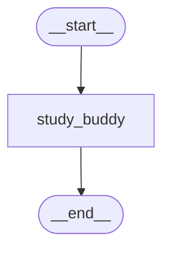

# LangGraph Basics — Part 4: Checkpointers, Memory & Streaming

[](https://shafiqulai.github.io)
[](#)
[](https://python.org)
[](https://github.com/langchain-ai/langgraph)
[](../../LICENSE)

> **Read the full tutorial →** [shafiqulai.github.io/blogs/blog_11.html](https://shafiqulai.github.io/blogs/blog_11.html)

---

## What This Project Covers

In Parts 1–3, every graph invocation started from a blank slate — state was initialised on every call and discarded at the end. **Part 4 changes that.**

A **checkpointer** is a persistence backend that LangGraph attaches to a compiled graph. Before every node runs, LangGraph loads the latest checkpoint for the current thread. After the node finishes, LangGraph saves the updated state. The result: the graph automatically accumulates conversation history across as many turns as you want, without any changes to the nodes themselves.

This project builds a **Personal Study Buddy** — an AI tutor that remembers everything it has discussed with each student. Alice can ask three follow-up questions in a row and the buddy will reference earlier answers. Bob starts a completely separate session and has no idea what Alice asked. Two threads, two isolated histories, zero extra code.

---

## Key Concepts

| Concept | What It Is |
|---------|-----------|
| `MemorySaver` | In-process checkpointer — stores state in a Python dict; fast, zero setup, lost on restart |
| `SqliteSaver` | File-backed checkpointer — stores state in a `.db` file; survives restarts, shareable |
| `graph.compile(checkpointer=...)` | The single argument that adds persistent memory to any graph |
| `thread_id` | A string key in `config["configurable"]` that isolates one conversation from all others |
| `add_messages` reducer | Appends each new message to the list instead of overwriting it; works with the checkpointer to accumulate history |
| `get_state(config)` | Returns the current checkpoint snapshot for a thread |
| `get_state_history(config)` | Returns every checkpoint ever saved for a thread (full audit trail) |
| `invoke()` | Runs the graph and returns the final state dict when all nodes finish |
| `stream(stream_mode="messages")` | Yields LLM tokens one at a time as they are generated |

---

## MemorySaver vs SqliteSaver

| Feature | `MemorySaver` | `SqliteSaver` |
|---------|--------------|---------------|
| Storage | Python dict (in RAM) | SQLite `.db` file |
| Setup | None | `SqliteSaver.from_conn_string("file.db")` |
| Survives restarts | No | Yes |
| Use case | Development, testing, demos | Production, notebooks, multi-session apps |
| Extra dependency | None | `langgraph-checkpoint-sqlite==3.0.3` |

---

## Graph Architecture

```
START
  │
  ▼
study_buddy   ← checkpointer loads full history → Gemini replies → checkpointer saves updated state
  │
  ▼
 END
```

The graph has one node. The power comes from what happens *around* it: the checkpointer automatically loads all prior messages before `study_buddy` runs and saves the updated list after it returns. The node itself is stateless — it just sees a list of messages and calls the LLM.

---

## Mermaid Diagram



---

## Project Structure

```
basics-4-checkpointers-memory-streaming/
├── state.py          # StudyState — messages with add_messages reducer
├── nodes.py          # StudyBuddyNodes — study_buddy_node calls Gemini with full history
├── graph.py          # StudyBuddyGraph — compiles with checkpointer, exposes save_figure()
├── study_runner.py   # StudyRunner — chat(), stream_chat(), get_history(); multi-turn demo
├── app.py            # StudyBuddyApp — Gradio Blocks with gr.State for per-tab thread_id
├── config.py         # Config — loads .env, exposes MODEL_NAME, TEMPERATURE, MAX_RETRIES
├── llm.py            # GeminiLLM — wraps ChatGoogleGenerativeAI using Config
├── prompts/
│   └── study_buddy.txt  # System prompt loaded at init; defines the study buddy persona
└── figure/              # Auto-generated graph diagrams (graph.mmd, graph.png)
```

---

## State

```python
from typing import Annotated
from langchain_core.messages import BaseMessage
from langgraph.graph.message import add_messages
from typing_extensions import TypedDict

class StudyState(TypedDict):
    messages: Annotated[list[BaseMessage], add_messages]
```

`add_messages` is a reducer that appends new messages instead of replacing the list. Without it, every call to `invoke()` would overwrite the history with just the latest message — the checkpointer would save only one turn. With it, each AI reply is appended, and the checkpointer saves the growing list after every turn.

---

## The Node

```python
class StudyBuddyNodes:
    def __init__(self):
        self.llm           = GeminiLLM().get_llm()
        self.system_prompt = _load_prompt("study_buddy.txt")

    def study_buddy_node(self, state: StudyState) -> dict:
        system   = SystemMessage(content=self.system_prompt)
        messages = [system] + state["messages"]
        response = self.llm.invoke(messages)
        return {"messages": [response]}
```

`state["messages"]` already contains the full conversation history — the checkpointer loaded it before this node ran. The node prepends the system prompt, calls Gemini, and returns the new AI message. `add_messages` appends it; the checkpointer saves the result. The node is not responsible for memory; the infrastructure handles it.

---

## Compiling with a Checkpointer

```python
from langgraph.checkpoint.memory import MemorySaver

class StudyBuddyGraph:
    def __init__(self, checkpointer=None):
        self.nodes = StudyBuddyNodes()
        self.checkpointer = checkpointer or MemorySaver()
        self.compiled_graph = self._build()

    def _build(self):
        graph = StateGraph(StudyState)
        graph.add_node("study_buddy", self.nodes.study_buddy_node)
        graph.add_edge(START, "study_buddy")
        graph.add_edge("study_buddy", END)
        return graph.compile(checkpointer=self.checkpointer)
```

The `checkpointer` parameter defaults to `MemorySaver()` for development. To switch to SQLite, pass `SqliteSaver.from_conn_string("study_buddy.db")` when constructing the graph — no other code changes needed.

---

## Thread IDs

```python
config = {"configurable": {"thread_id": "alice-session-001"}}
result = app.invoke({"messages": [HumanMessage(content=message)]}, config=config)
```

The `thread_id` is the isolation key. The checkpointer stores state separately for each unique `thread_id`. Alice's session and Bob's session share the same graph object but have completely separate histories — changing `thread_id` is all it takes.

---

## Streaming Tokens

```python
for chunk, _ in app.stream(
    {"messages": [HumanMessage(content=message)]},
    config=config,
    stream_mode="messages",
):
    if not hasattr(chunk, "content"):
        continue
    content = chunk.content
    # langchain-google-genai 4.x returns content as a list of typed blocks
    if isinstance(content, str) and content:
        yield content
    elif isinstance(content, list):
        for block in content:
            if isinstance(block, dict) and block.get("type") == "text":
                text = block.get("text", "")
                if text:
                    yield text
```

`stream_mode="messages"` yields LLM output tokens as they arrive. The content check handles both plain strings (older LangChain versions) and typed block lists (`langchain-google-genai` 4.x). The Gradio UI accumulates these tokens and yields the full response so far on each iteration, producing a live-typing effect.

---

## Reading Saved State

```python
# Latest state for a thread
state = app.get_state(config)
messages = state.values.get("messages", [])

# Full checkpoint history for a thread
snapshots = list(app.get_state_history(config))
```

`get_state` returns the most recent checkpoint. `get_state_history` returns every checkpoint ever saved — useful for debugging, replaying conversations, or implementing undo.

---

## Example Console Output

```
============================================================
   LangGraph Basics — Personal Study Buddy Demo
============================================================

  Saving graph architecture...
  Graph saved → figure/graph.mmd
  Graph saved → figure/graph.png

👩‍🎓  Alice's Study Session (thread: alice-session-001)
------------------------------------------------------------

🙋  Alice: Can you explain recursion to me? I'm a complete beginner.

🤖  Study Buddy:
Think of recursion like Russian nesting dolls — to open the biggest doll,
you open a slightly smaller one, and to open that one you open an even
smaller one, until you reach the tiniest doll that just opens directly.
...

🙋  Alice: That makes sense! Can you show me a Python code example?

🤖  Study Buddy:
Sure! Here is the classic factorial example using the nesting-doll idea
we discussed...
------------------------------------------------------------

🔍  Thread Isolation Proof
------------------------------------------------------------

🙋  Alice (follow-up): Can you remind me — what analogy did you use earlier?

🤖  Study Buddy:
Earlier I used the analogy of Russian nesting dolls to explain recursion...

📋  Alice's saved message history:
------------------------------------------------------------
  [1] HumanMessage: Can you explain recursion to me? I'm a complete beginner...
  [2] AIMessage: Think of recursion like Russian nesting dolls...
  [3] HumanMessage: That makes sense! Can you show me a Python code example?...
  [4] AIMessage: Sure! Here is the classic factorial example...
  [5] HumanMessage: How is recursion different from a regular for loop?...
  [6] AIMessage: Great question! Let me compare them side by side...
  [7] HumanMessage: Can you remind me — what analogy did you use earlier?...
  [8] AIMessage: Earlier I used the analogy of Russian nesting dolls...

  Total messages stored for Alice: 8
============================================================
```

---

## How to Run

**Prerequisites:** complete the setup in the [root README](../../README.md) (virtual environment + `.env` file).

**Console runner:**

```bash
cd basics-4-checkpointers-memory-streaming
python study_runner.py
```

**Gradio web UI:**

```bash
cd basics-4-checkpointers-memory-streaming
python app.py
```

The web UI starts at `http://127.0.0.1:7860`. Each browser tab gets its own `thread_id` via `gr.State`, so opening two tabs gives two completely isolated study sessions. Click **New Session** to clear the chat and start fresh with a new `thread_id`.

**Conversations to try:**

| Turn | Message | What it demonstrates |
|------|---------|---------------------|
| 1 | `"Can you explain recursion to me?"` | First turn, no history yet |
| 2 | `"Show me a Python example"` | Buddy remembers the topic without you repeating it |
| 3 | `"How is it different from a for loop?"` | Third turn with growing history |
| 4 | `"What analogy did you use earlier?"` | Proves memory is working across turns |

---

## Full Tutorial

Everything above — the concepts, the code walkthrough, MemorySaver vs SqliteSaver, stream modes, and a live Gradio demo — is covered in detail in the blog post:

**[LangGraph Basics: Part 4 — Checkpointers, Memory & Streaming](https://shafiqulai.github.io/blogs/blog_11.html)**

---

## Series Navigation

| Part | Topic | Link |
|------|-------|------|
| ← Part 3 | Conditional Edges & Routing Logic | [basics-3-conditional-edges/](../basics-3-conditional-edges/) |
| **Part 4** | **Checkpointers, Memory & Streaming** | **You are here** |
| Part 5 → | Tools, ToolNode & Prebuilt Components | Coming soon |

---

## Author

**Md Shafiqul Islam** — AI Engineer / LLM Specialist  
Blog: [shafiqulai.github.io](https://shafiqulai.github.io)
