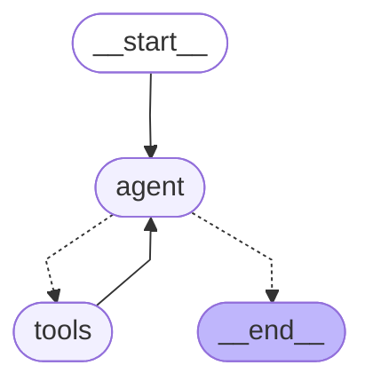

# LangGraph Basics — Part 5: Tools, ToolNode & Prebuilt Components

[](https://shafiqulai.github.io)
[](#)
[](https://python.org)
[](https://github.com/langchain-ai/langgraph)
[](../../LICENSE)

> **Read the full tutorial →** [shafiqulai.github.io/blogs/blog_12.html](https://shafiqulai.github.io/blogs/blog_12.html)

---

## What This Project Covers

In Parts 1–4, every node called the LLM and returned a text answer. **Part 5 changes what the LLM can do.**

A **tool** is a Python function the LLM can call when it needs one. Instead of guessing a loan calculation or estimating a currency rate, the LLM delegates the computation to the right function and uses the exact result in its reply. **ToolNode** executes those calls automatically. **tools_condition** routes the graph based on whether the LLM returned a tool call or a final answer. Together, they implement the **ReAct loop** — Reason → Act → Observe → Reason again — with just three edges.

This project builds a **Personal Finance Assistant** for Priya, a software engineer who wants exact answers — not estimates — for loan EMIs, compound savings, currency conversion, and budget splits.

---

## Key Concepts

| Concept | What It Is |
|---------|-----------|
| `@tool` | Decorator that converts a Python function into a LangChain Tool with a name, description, and JSON schema |
| Tool docstring | The description the LLM reads to decide *when* to use the tool — write it clearly |
| `bind_tools(tools)` | Injects tool schemas into the LLM's context so it knows what tools are available |
| `AIMessage.tool_calls` | Field the LLM populates when it wants to call a tool — contains name + arguments |
| `ToolNode` | Prebuilt LangGraph node that reads `tool_calls`, runs the matching function, returns a `ToolMessage` |
| `ToolMessage` | The result of a tool call — added to state so the LLM can read it on the next turn |
| `tools_condition` | Prebuilt conditional edge: routes to "tools" if `tool_calls` is present, else routes to END |
| `create_react_agent` | Prebuilt helper that assembles the full ReAct graph (agent + ToolNode + tools_condition) in one call |

---

## Graph Architecture

```
START
  │
  ▼
agent  ──── has tool_calls? ──── yes ──── tools
  ▲                                         │
  │                                         │
  └─────────────────────────────────────────┘
  │
  └─── no tool_calls? ──── END
```

The agent node calls the tool-bound LLM. If the LLM wants a tool, `tools_condition` routes to ToolNode. ToolNode runs the function and adds the result to state as a ToolMessage. Execution loops back to the agent, which reads the result and either calls another tool or writes a final answer. When the agent writes a final answer (no `tool_calls`), `tools_condition` routes to END.

---

## Mermaid Diagram



Dashed arrows = conditional edges (tools_condition). Solid arrows = fixed edges.

---

## Project Structure

```
basics-5-tools-toolnode/
├── config.py                    # Config — loads .env, exposes MODEL_NAME, TEMPERATURE, MAX_RETRIES
├── llm.py                       # GeminiLLM — wraps ChatGoogleGenerativeAI using Config
├── state.py                     # FinanceState — messages with add_messages reducer
├── tools/                       # BaseTool subclasses — one class per file
│   ├── __init__.py              # exports TOOLS = [LoanPaymentTool(), ...]
│   ├── loan_payment.py          # LoanPaymentTool — monthly EMI calculation
│   ├── compound_interest.py     # CompoundInterestTool — savings growth projection
│   ├── convert_currency.py      # ConvertCurrencyTool — currency conversion via USD
│   └── split_budget.py          # SplitBudgetTool — income allocation by category
├── nodes.py                     # FinanceNodes — agent_node with bind_tools()
├── graph.py                     # FinanceGraph — ReAct loop wiring, save_figure()
├── finance_runner.py            # FinanceRunner — chat(); console demo with 4 queries
├── app.py                       # FinanceApp — Gradio ChatInterface
├── prompts/
│   ├── system.txt               # System prompt: role + tool-usage instructions
│   ├── loan_payment.txt         # Description loaded by LoanPaymentTool
│   ├── compound_interest.txt    # Description loaded by CompoundInterestTool
│   ├── convert_currency.txt     # Description loaded by ConvertCurrencyTool
│   └── split_budget.txt         # Description loaded by SplitBudgetTool
└── figure/                      # Auto-generated by graph.py (graph.mmd, graph.png)
```

---

## State

```python
from typing import Annotated
from langchain_core.messages import BaseMessage
from langgraph.graph.message import add_messages
from typing_extensions import TypedDict

class FinanceState(TypedDict):
    messages: Annotated[list[BaseMessage], add_messages]
```

`add_messages` ensures every new message (HumanMessage, AIMessage, ToolMessage) is appended to the list rather than replacing it. This is essential for tool-calling agents — the LLM must read the ToolMessage on its next turn to know the result.

---

## The 4 Finance Tools

Each tool is a `BaseTool` subclass in its own file inside the `tools/` package. All use pure Python arithmetic — no external APIs.

| File | Class | What It Computes | Key Arguments |
|------|-------|-----------------|---------------|
| `tools/loan_payment.py` | `LoanPaymentTool` | Fixed monthly EMI using compound interest formula | `principal`, `annual_rate_pct`, `months` |
| `tools/compound_interest.py` | `CompoundInterestTool` | Final savings after annual compounding | `principal`, `annual_rate_pct`, `years` |
| `tools/convert_currency.py` | `ConvertCurrencyTool` | Currency conversion via USD as intermediate | `amount`, `from_currency`, `to_currency` |
| `tools/split_budget.py` | `SplitBudgetTool` | Monthly income split into named categories | `monthly_income`, `rent_pct`, `food_pct`, `savings_pct` |

Supported currencies for conversion: USD, EUR, GBP, JPY, BDT, CAD, AUD, INR.

---

## The Agent Node

```python
class FinanceNodes:
    def __init__(self):
        llm = GeminiLLM().get_llm()
        self.llm_with_tools = llm.bind_tools(TOOLS)
        self.system_prompt  = _load_prompt("system.txt")

    def agent_node(self, state: dict) -> dict:
        messages = [SystemMessage(content=self.system_prompt)] + state["messages"]
        response = self.llm_with_tools.invoke(messages)
        return {"messages": [response]}
```

`bind_tools()` is called once in `__init__`. The system prompt is prepended on every turn so the LLM always has its role and tool-usage instructions — even mid-loop after a tool call.

---

## Graph Wiring

```python
graph.add_edge(START, "agent")
graph.add_conditional_edges("agent", tools_condition)  # agent → tools | END
graph.add_edge("tools", "agent")                       # after tools, back to agent
```

Three lines. That's the entire ReAct loop.

---

## How to Run

**Console runner:**

```bash
cd basics-5-tools-toolnode
python finance_runner.py
```

Expected output:
```
============================================================
   LangGraph Basics — Personal Finance Assistant Demo
============================================================

  Saving graph architecture...
  Graph saved → .../figure/graph.mmd
  Graph saved → .../figure/graph.png

💬 Priya:     What would my monthly payment be on a $20,000 car loan at 6% interest for 48 months?
🤖 Assistant: Your monthly payment would be $469.70 for 48 months...
------------------------------------------------------------
...
```

**Gradio web UI:**

```bash
python app.py
```

Opens at `http://127.0.0.1:7860`. Type any finance question — loan, savings, currency, or budget.

---

## Using create_react_agent (Shortcut)

```python
from langgraph.prebuilt import create_react_agent
from langchain_google_genai import ChatGoogleGenerativeAI
from tools import TOOLS

llm = ChatGoogleGenerativeAI(model="gemini-3-flash-preview")

app = create_react_agent(
    model=llm,    # plain LLM — create_react_agent calls bind_tools() internally
    tools=TOOLS,
    prompt="You are a helpful personal finance assistant. Use tools for all calculations.",
)
```

`create_react_agent` builds the same graph (MessagesState + agent node + ToolNode + tools_condition) automatically. Pass the plain LLM — not `llm.bind_tools()` — or tools get bound twice.

---

## Series Navigation

← [Part 4 — Checkpointers, Memory & Streaming](../basics-4-checkpointers-memory-streaming/README.md) &nbsp;|&nbsp; **Part 5 — Tools, ToolNode & Prebuilt Components** &nbsp;|&nbsp; Part 6 — Subgraphs, Interrupt & Human-in-the-Loop →
